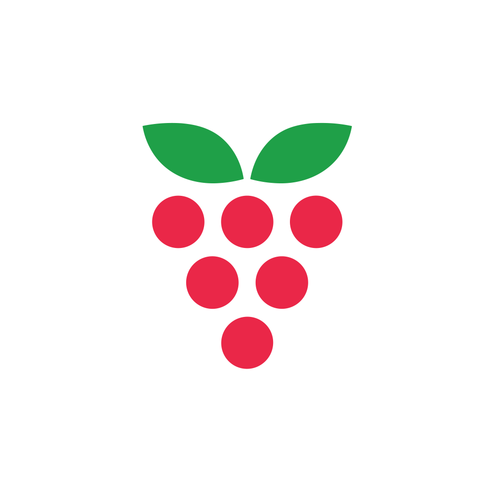

<div align="center">
  
</div>

# Raspy Bot
[](https://www.codefactor.io/repository/github/raspyorg/bot)

Open Source Roblox Discord Bot for servers. Packed with features for many games, Roblox management tools and automations.

# How to use

To run you can use the commands

```bash
node . # or npm start
```

For making the .env file you can start by inspecting .env.example
For a more detailed guide: [Documentation](#documentation)

# Contributing

To contribute, please fork this repository and make the neccesarry changes. Then you may submit a Pull Request.

# Documentation

You can view the full documentation here:
[https://raspy.gaxo.workers.dev](https://raspy.gaxo.workers.dev)

GitHub Repository:
[https://github.com/RaspyORG/docs/](https://github.com/RaspyORG/docs/)
